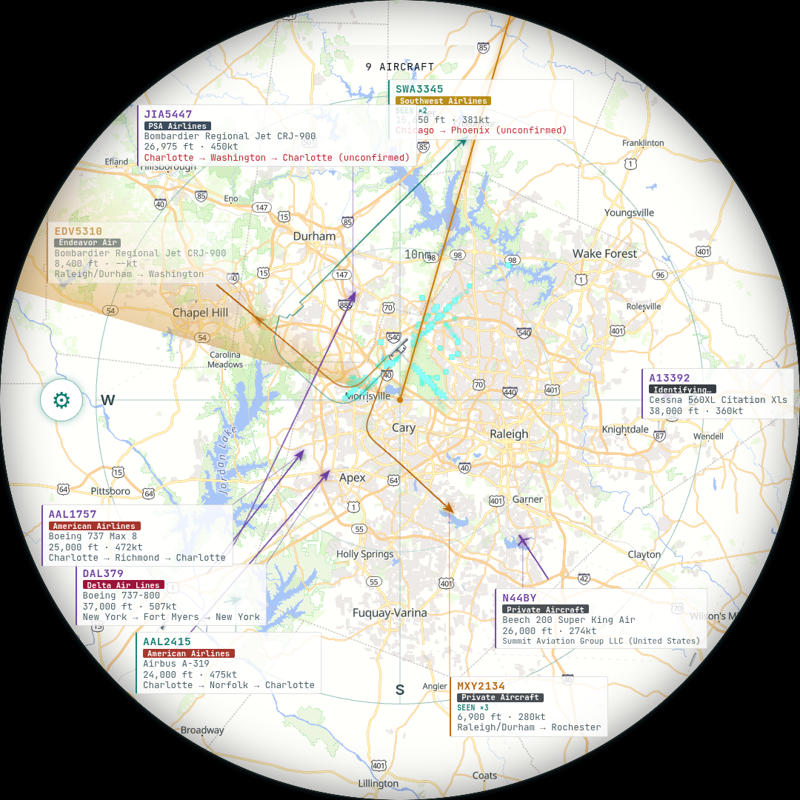

# FlightRadar

A live ADS-B flight radar for a wall-mounted round display, built on a
Raspberry Pi and a cheap SDR dongle — no subscription, no cloud service,
just a local receiver and a browser.



## What it does

Point an RTL-SDR dongle and a small antenna at the sky, and FlightRadar turns
whatever ADS-B traffic it hears into a live circular radar display: bearing,
range, altitude, speed, heading, airline, aircraft type, route, and (when
available) a real photo of the airframe. It's designed to run unattended,
full-screen, on a small round touch panel mounted on a wall — but it's also
just a web page, so it runs fine in a normal browser too.

- **Live tracking** — polls a local [`readsb`](https://github.com/wiedehopf/readsb)
  instance every second; altitude-coded blips, smooth interpolation between
  polls, a "NO SIGNAL" banner on connection loss
- **Airline & route lookup** — badges each flight with its airline and shows
  its city-pair route where one's known, including multi-stop regional
  rotations
- **Aircraft type & photo** — human-readable type names ("Bombardier Regional
  Jet CRJ-900") and a real photo when one exists, falling back to a
  representative photo of the type
- **Background map** — real terrain, roads, and runway outlines (cached once
  fetched, so a restart doesn't wait on a fresh query), darkened and centered
  on the receiver, with an always-on live weather radar overlay and an
  optional satellite lightning-strike overlay
- **RDU approach visualization** — a real density heatmap built from actually
  observed landings over time, not a canned flight-path overlay — busier
  stretches of the corridor read as more visually distinct than lightly-used
  ones, and it keeps sharpening the longer the receiver runs
- **Sighting counts** — every aircraft tracks how many distinct times this
  receiver has picked it up, and how many of those came within the
  nearby-alert radius; shown as a "SEEN ×N" badge once it's more than one,
  and as fields in the detail panel always
- **Registered-owner lookup** — for aircraft confirmed private (a real
  callsign, just not an airline one), the detail panel shows who the plane
  is registered to, pulled from public aircraft-registry data
- **Nearby-aircraft alert** — auto-pops flight details (with a chime) for
  anything passing within 2 miles of the receiver
- **Lightning proximity alert** — a chime + banner when a satellite-observed
  strike is detected within 15nm of the receiver, independent of the map's
  lightning overlay toggle
- **Emergency squawk alert** — an unmistakable alert (distinct chime + a red
  auto-popped panel) for 7500 (hijack), 7600 (radio failure), or 7700
  (general emergency)
- **RDU landing/takeoff highlight** — a bright green ring around the blip and
  label of anything currently landing or departing at RDU, plus an optional
  quiet chime; pairs with an optional link to LiveATC.net's live
  approach/departure audio for the airport
- **Night dimming** — the display darkens between sunset and sunrise,
  computed from the receiver's own coordinates so it tracks the seasons
  without any configuration; alerts can optionally undim it
- **Screensaver** — the panel genuinely powers off after a configurable idle
  period (see [`deploy/`](deploy/)) and wakes on touch, or on an alert if
  you've enabled that
- **Settings panel** — a gear icon opens on-screen toggles for all of the
  above (nearby alert, emergency squawks, RDU landing/takeoff chime, RDU ATC
  audio link, night dimming), persisted per-device
- **Touch detail panel** — tap any aircraft for registration, squawk, vertical
  rate, and more
- **Native iOS companion app** — a SwiftUI rebuild of the same radar for
  iPhone, talking to the same receiver over Tailscale

## How it works

```
[Antenna] → [RTL-SDR dongle] → [readsb] → aircraft.json (local)
                                                 │
                                                 ▼
                                   [FlightRadar: fetch + render]
                                                 │
                                                 ▼
                              [Chromium kiosk, full-screen] → [round display]
```

`readsb` decodes raw ADS-B signals and writes `aircraft.json` to disk.
`index.html` is a single self-contained page — plain HTML/CSS/JS, Canvas for
the radar itself, [MapLibre GL JS](https://maplibre.org/) for the background
map — that polls that file and renders everything. No build step, no
framework, no server-side code beyond a couple of tiny same-origin proxies
(see [`deploy/`](deploy/)) for things browsers can't do directly, like
setting a custom User-Agent.

## Getting started

**Hardware and receiver setup** (Pi, RTL-SDR dongle, antenna, `readsb`
installation) is covered in [`docs/project-spec.md`](docs/project-spec.md),
including a suggested two-wave purchase plan so you can confirm reception
before buying a display.

**Running the web app locally**, against a receiver on your network:

```bash
python3 dev-server.py
```

Then open `http://localhost:8000/index.html`. `dev-server.py` proxies
`/tar1090/*` requests to your receiver so the page can be tested with the
exact same relative paths it uses once deployed — edit `PI_HOST` at the top
of the file to point at your own receiver. It's dev-only and isn't part of
the deployed app.

**Deploying as a kiosk**: `index.html` is a static file — copy it to your
receiver's web server docroot (same origin as `readsb`'s own web UI, to avoid
CORS). [`deploy/`](deploy/) has a systemd unit for launching Chromium in
kiosk mode on boot, plus four small same-origin proxy services: aircraft
photos, the shared approach-track store, the shared sighting-count store, and
(only relevant if you expose the page to the public internet, e.g. via
Tailscale Funnel) a filtering gateway that rounds the receiver's exact
coordinates before they leave your network — see [Security](#security)
below. Two of those units are `systemctl --user` services rather than
system ones (the screensaver and the display-wake endpoint), because they
need the graphical session's `WAYLAND_DISPLAY` to reach the compositor.

**iOS app**: `ios/` is an [XcodeGen](https://github.com/yonaskolb/XcodeGen)
project. Run `xcodegen generate` inside `ios/` if you change `project.yml`,
then open `FlightRadar.xcodeproj` in Xcode. Set your own signing team under
Signing & Capabilities, and point it at your receiver's address in the app's
Settings screen.

## Project structure

```
index.html      the whole web app — single file, no build step
dev-server.py   local-only dev proxy (not deployed)
deploy/         systemd units + same-origin proxy services for the kiosk
docs/           hardware/software spec, original prototype, screenshots
vendor/         vendored MapLibre GL JS (self-hosted, no CDN dependency)
ios/            native SwiftUI companion app
```

See [CHANGELOG.md](CHANGELOG.md) for release notes and
[HANDOFF.md](HANDOFF.md) for the detailed development history.

## Data sources

FlightRadar leans entirely on free, no-key-required public data, same as
[tar1090](https://github.com/wiedehopf/tar1090) (which inspired several of
these choices, though no code is shared — its license is unclear):

- **[readsb](https://github.com/wiedehopf/readsb)** — ADS-B decoding
- **[MapLibre GL JS](https://maplibre.org/)** (BSD-3-Clause, vendored under [`vendor/`](vendor/) — self-hosted, no CDN dependency) + **[OpenFreeMap](https://openfreemap.org/)** — background map tiles/style
- **[OpenStreetMap](https://www.openstreetmap.org/) via Overpass** — real runway/taxiway geometry
- **[adsb.im](https://adsb.im/)** — route (city-pair) lookups
- **[RainViewer](https://www.rainviewer.com/)** — live weather radar overlay
- **[planespotters.net](https://www.planespotters.net/)** — aircraft photos
- **[Wikipedia / Wikimedia Commons](https://www.wikipedia.org/)** — representative type photos when no tail-specific one exists
- **[adsbdb.com](https://www.adsbdb.com/)** — registered-owner lookups for confirmed-private aircraft
- **[LiveATC.net](https://www.liveatc.net/)** — RDU ATC audio, opened as a link to their own player (see [Security](#security) below for why it's a link, not an embed)
- **[SSEC RealEarth](https://realearth.ssec.wisc.edu/)** (UW-Madison) — satellite-observed lightning strike density (GOES-East GLM)

Please respect each service's own terms of use if you build on this.

## Security

If you expose this beyond your own LAN (e.g. a Tailscale Funnel URL, like the
live deployment this repo was built against), a few things are worth knowing
before you do:

- **The receiver's exact coordinates are not something you want publicly
  reachable.** `readsb`'s own `receiver.json` endpoint returns
  survey-precision lat/lon, and by default that's reachable by anyone who
  finds the URL. [`deploy/funnel-gateway.py`](deploy/funnel-gateway.py) sits
  in front of whatever you expose publicly and rounds those coordinates to
  ~0.7 mile precision for public traffic only — your LAN/kiosk always sees
  the exact value, which `readsb` itself needs for its own signal-range math.
  Point your public tunnel at this gateway instead of at `readsb`/lighttpd
  directly.
- **External data (route text, photo credits, aircraft type) is escaped
  before it touches the DOM.** Some of it — a photographer's display name on
  planespotters.net, for instance — is third-party user-submitted content
  this app doesn't control.
- **The shared same-origin stores** (`deploy/approach-store.py`,
  `deploy/sighting-store.py`) have no authentication — by design, low
  stakes, matches how the app itself treats that data — but they do cap
  request body size and validate input shape, since they're reachable from
  wherever you expose the page.
- **The display-wake endpoint is refused for public traffic.** `/wake`
  physically powers the kiosk's panel on, so
  [`deploy/funnel-gateway.py`](deploy/funnel-gateway.py) 404s it for
  anything arriving through the public tunnel (`LOCAL_ONLY_PATHS`). It's
  harmless in isolation, but it's an unauthenticated side effect on hardware
  in your house, and nothing off-LAN has any business reaching it.
- **No secrets or API keys anywhere.** Every external service this app talks
  to is free and keyless (see [Data sources](#data-sources) above), so
  there's nothing to leak.
- **RDU ATC audio is a link, not an embed.** LiveATC.net's
  [Terms of Use](https://www.liveatc.net/legal/) require consulting them
  before linking directly to a raw audio stream, and separately bar making
  their service "directly available" through another dedicated application,
  for profit or not. The ATC toggle opens their own player page in a normal
  browser tab instead — ordinary use of their site, same as bookmarking it
  yourself — and is disabled outright on the kiosk itself (`?kiosk=1` on its
  launch URL), since a new browser window/tab inside `--kiosk` Chromium has
  no touch-reachable way back to the radar.

## License

MIT — see [LICENSE](LICENSE).
