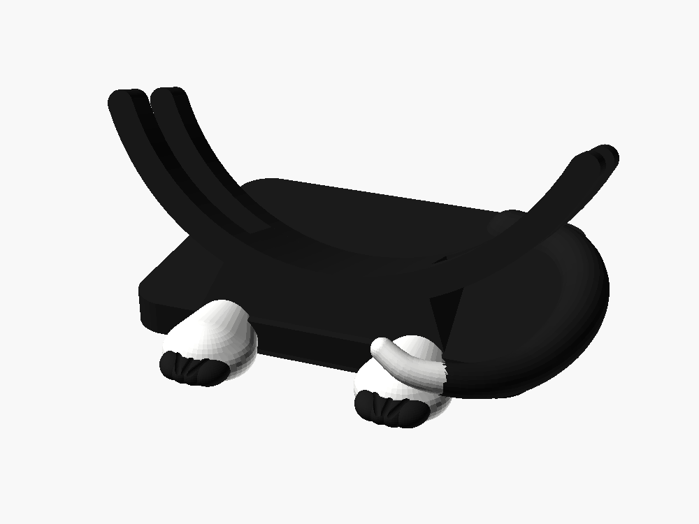

# Kitten enclosure — two-tone

A tuxedo version of the [Kitten Enclosure](../Kitten%20Enclosure/): black
stand, **white paws with black toes**, and a **black tail with a white tip**.
The paws and tail are also about 15% larger, because at two colours they stop
being a silhouette detail and become the thing the eye lands on.



The original is untouched and still printable — this is a fork, not a
replacement. Every dimension that touches a physical part is unchanged from
it, and therefore from the
[Retro Radar Enclosure](../Retro%20Radar%20Enclosure/) it inherited them from:
the 203.34mm round panel, the Pi's 58×49 standoff pattern, the two 100×45mm
speakers, the 30mm fan, the M3 screw ring, the USB-C and SMA bulkheads. The
head is identical. **Only the stand differs**, so a head printed from either
design sits in either stand.

## Parts

The head is one colour and prints as before:

| part | colour | what it is |
|---|---|---|
| `shell` | black | the head — body cylinder plus two ears, and all the internals |
| `front_trim` | black | the face — bezel ring with a nose and whisker grooves |
| `retainer` | — | ring behind the glass (identical to the retro part) |

The stand is split into five bodies, one per colour region:

| part | colour | what it is |
|---|---|---|
| `stand_body` | **black** | plinth, cradle arms, keel |
| `stand_paws` | **white** | both foot pads |
| `stand_toes` | **black** | the eight toe lobes |
| `stand_tail` | **black** | the tail from root to the white tip |
| `stand_tail_tip` | **white** | the flicked-up end |

`stand` is still there as a single-piece, single-colour version of exactly the
same shape — useful as a fallback, and as the reference the five parts are
checked against.

## Printing it in two colours

The five stand bodies share one coordinate frame, so they occupy their true
positions relative to each other. That gives you two routes:

**Multi-material (AMS, MMU, tool changer).** Import all five as a single
object — in most slicers, load the first, then "add part"/"load as part" for
the rest, which preserves their positions — and assign a filament to each.
No supports needed for the paws or toes; the tail tip lifts off the paw and
wants a little support under the flick.

**Single extruder.** Print them as separate objects and glue. Every split
follows a real seam in the shape — pad to toe, tail to tip — so the joins
land where the eye already expects a line. Print `stand_body` flat on its
base; the paws, toes and tail parts are all small and sit stably on their cut
faces.

Whichever route, the bodies are **mutually exclusive** — no overlaps. That
matters more than it sounds: slicers resolve overlapping bodies differently,
usually "last one loaded wins", so an overlap of even a millimetre puts the
colour seam somewhere that depends on the order you happened to load them.

## Where the colour goes, and why

- **Paws white, toes black.** The toes are the detail that makes a paw read
  as a paw, and they are small — they need the contrast more than the pad
  does. The clefts between them grew with the toes; the groove is the only
  thing making four toes read as four rather than one lumpy pad.
- **Tail black, tip white, and the tip lifts.** The first version had the tip
  resting flat on the pad, which is what a sitting cat does — but that put a
  white tip on top of a white paw, where it vanished. The whole point of a
  white tip is that it reads against what surrounds it. Lifted, it is
  silhouetted from every angle, and a flicked tail tip is cat-like anyway.
  This was caught by rendering it and looking, not by any check.

## Checks

`sh run-checks.sh` runs every target in `checks.scad` and reports the
**volume** each produces.

Volume, not "is it empty". Wherever two parts share a surface — which is the
entire point of the colour split, since the toes sit in the pads and the tip
continues the tail — a boolean leaves a zero-thickness film along that
boundary, with thousands of facets and no volume. Judging by facet count
calls a correct model broken. The threshold is 1mm³ against a paw of roughly
10,000mm³, so a real interference has nowhere to hide.

Alongside the fit checks inherited from the single-colour design, the split
adds:

- `material_lost` — a region of the one-piece stand that no coloured part
  claims. That would print as a hole.
- `material_gained` — a region two parts both claim. That is where the slicer
  gets to pick a colour for you.
- `paws_vs_toes`, `paws_vs_tail`, `body_vs_paws`, `tail_vs_tip` — pairwise
  overlap, checked pairwise because a mutual overlap hides inside a union.
- `canary` — must produce geometry. Without it, a typo in the `use <>` path
  makes every check above pass against nothing, which has happened here
  before.

As an independent confirmation that does not rely on OpenSCAD's own booleans,
the exported meshes were measured: the five parts sum to 750,877.9mm³ against
the one-piece stand's 750,877.9mm³, a difference of 0.000%.

## Regenerating

```sh
for p in shell front_trim retainer stand \
         stand_body stand_paws stand_toes stand_tail stand_tail_tip; do
  openscad --backend=manifold -D "part=\"$p\"" -o "$p.stl" kitten-enclosure-twotone.scad
done
```

The `.stl` files are committed alongside the source so the folder is
self-contained, but they are generated. Change the `.scad` and both must be
re-exported and committed together, or the mesh quietly stops matching the
source it claims to come from.
